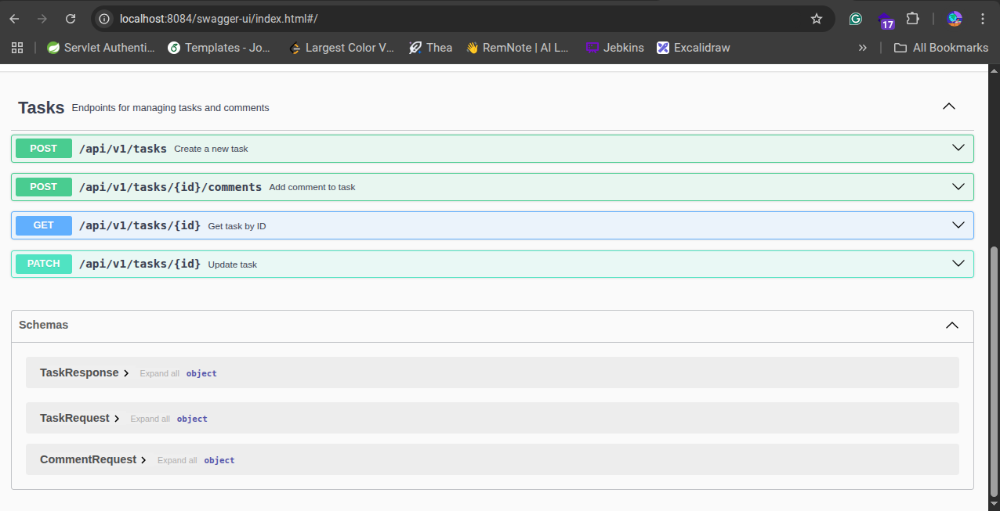

# task Management System Microservices

## 📌 Overview
A distributed Task Management System built with a microservices architecture, designed to handle task tracking, notifications, and collaboration (and in the future user authentication).
This project demonstrates real-world engineering practices, including service isolation, inter-service communication, and scalability.
The system is composed of multiple microservices communicating over REST and Kafka, and is designed for cloud deployment with Docker.

## 🚀 Features
✅ Task Service – create, update, delete, assign, and track tasks.

🔔 Notification Service –  manage users' notifications sent via Kafka.

🤝 Collaboration – team assignments.

📦 Scalability – containerized with Docker, CI/CD via Jenkins

📝 Tracing - Zipkin

API Documentation via OpenApi/Swagger


    
## ⚙️ Installation & Setup
1️⃣ Clone the repository
```
git clone https://github.com/Duru-DR/task-management-system-microservices.git
cd task-management-system-microservices
```

2️⃣ Start services with Docker Compose
```
docker-compose up --build
```

3️⃣ Access services

API Gateway → http://localhost:9090

Profile Service → http://localhost:8082 OR http://localhost:9090

Project Service → http://localhost:8083 OR http://localhost:9090

Task Service → http://localhost:8084 OR http://localhost:9090

Notification Service → http://localhost:8085 OR http://localhost:9090

Kafka-ui → http://localhost:8088

Zipkin → http://localhost:9411

Eureka Server → http://localhost:8761

## 🛠️ Tech Stack
Backend: Java 17, Spring Boot, Spring MVC, Spring Cloud

Database: PostgreSQL

Message Broker: Apache Kafka

API Gateway: Spring Cloud Gateway

Containerization: Docker, Docker Compose

Tracing: Zipkin

Database migrations through Flyway

Centralized Configuration through config server

## 📸 Screenshots

This is how the config repository should be structured with the appropriate configurations


These are the configurations:
### Application.yaml
```
server:
  port: 8080

  jpa:
    hibernate:
      ddl-auto: validate
    show-sql: true
    properties:
      hibernate:
        format_sql: true

  flyway:
    enabled: true
    locations: classpath:db/migration

logging:
  level:
    root: INFO
    org.springdoc: DEBUG
    org.springdoc.api: DEBUG
    org.springdoc.webmvc: DEBUG
    org.springframework.web: DEBUG
  pattern:
    level: "%5p [${spring.application.name:},traceId=%mdc{traceId:-},spanId=%mdc{spanId:-}]"

management:
  tracing:
    enabled: true
    sampling:
      probability: 1.0    
    propagation:
      type: [W3C, B3]
  zipkin:
    tracing:
      endpoint: http://zipkin:9411/api/v2/spans  

eureka:
  client:
    service-url:
      defaultZone: http://eureka-server:8761/eureka/
      
springdoc:
  api-docs:
    path: /v3/api-docs
  swagger-ui:
    url: /v3/api-docs
    enable: true

spring:
  jackson:
    serialization:
      write-dates-as-timestamps: false
```

### profile-service.yaml
```
spring:
  datasource:
    url: jdbc:postgresql://profile-db:5432/${PROFILE_DB_NAME}
    username: ${PROFILE_DB_USER}
    password: ${PROFILE_DB_PASSWORD}
    driver-class-name: org.postgresql.Driver
```

### project-service.yaml
```
spring:
  datasource:
    url: jdbc:postgresql://project-db:5432/${PROJECT_DB_NAME}
    username: ${PROJECT_DB_USER}
    password: ${PROJECT_DB_PASSWORD}
    driver-class-name: org.postgresql.Driver
```

### task-service.yaml
```
spring:
  datasource:
    url: jdbc:postgresql://task-db:5432/${TASK_DB_NAME}
    username: ${TASK_DB_USER}
    password: ${TASK_DB_PASSWORD}
    driver-class-name: org.postgresql.Driver
  kafka:
    bootstrap-servers: ${KAFKA_BOOTSTRAP_SERVERS:kafka:9092}
    producer:
      key-serializer: org.apache.kafka.common.serialization.StringSerializer
      value-serializer: org.springframework.kafka.support.serializer.JsonSerializer
    properties:
      spring.json.add.type.headers: false
```

### notification-service.yaml
```
spring:
  datasource:
    url: jdbc:postgresql://notification-db:5432/${NOTIFICATION_DB_NAME}
    username: ${NOTIFICATION_DB_USER}
    password: ${NOTIFICATION_DB_PASSWORD}
    driver-class-name: org.postgresql.Driver
  kafka:
    bootstrap-servers: ${KAFKA_BOOTSTRAP_SERVERS:kafka:9092}
    consumer:
      group-id: notification-service
      key-deserializer: org.apache.kafka.common.serialization.StringDeserializer
      value-deserializer: org.springframework.kafka.support.serializer.JsonDeserializer
      properties:
        spring.json.value.default.type: com.duru.notificationservice.dto.TaskCreatedEvent
        spring.json.trusted.packages: "*"
    listener:
      ack-mode: record
```

This shows the microservices that are registered to Eureka:


This shows all containers up and running:


This shows Kafka up and running:


This shows some endpoints, tested via Postman:


This shows Zipkin tracing:


This shows that database tables are updated successfully:


Swagger: Api documentation for each service:





## 🧑‍💻 Author
Duru – www.linkedin.com/in/fatima-ezzahra-raqioui-08821b324

## ⭐ Future Improvements
Add user authentication (JWT, 2FA, OAuth)

Implement WebSocket notifications for real-time updates.

Add CI/CD deployment on AWS/GCP.

Add Front-end (Angular)

